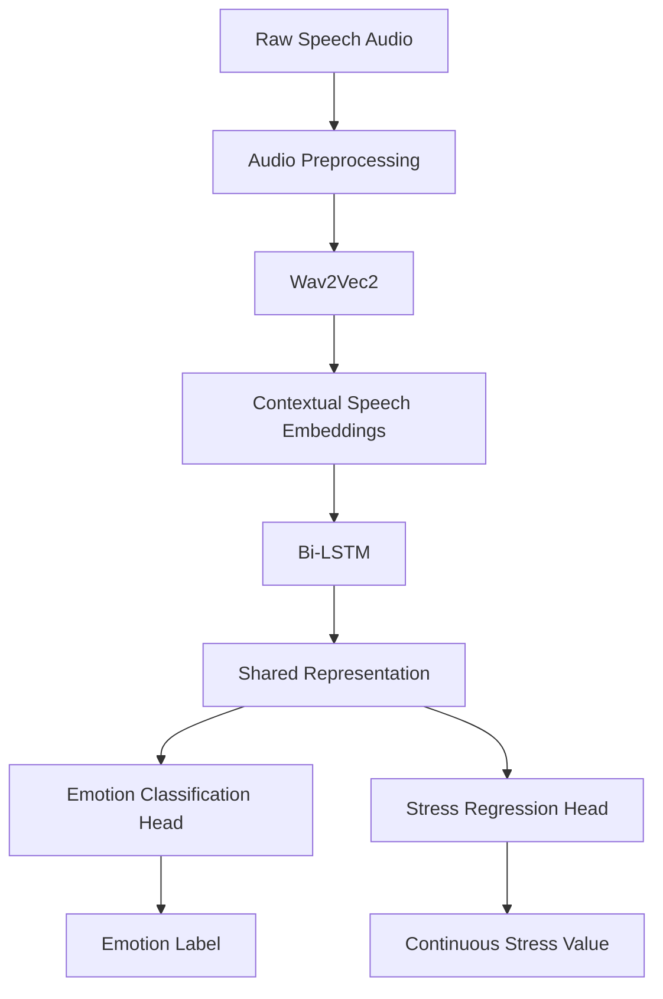

# 🎙️ EchoCareAI PRO

### Multitask Speech Emotion and Stress Detection Using a Hybrid Wav2Vec2–BiLSTM Model

AI-powered speech analysis system for **emotion recognition and continuous stress estimation** using Wav2Vec2, Bi-LSTM, and multi-task learning.

[📄 **Read the Research Paper**](./PID723.pdf) · [💻 **View Source Code**](https://github.com/ashutoshroy02/emo_stress_project)

---

## 🔬 Research

This repository contains the implementation associated with the research paper:

**“Multitask Speech Emotion and Stress Detection Using a Hybrid Wav2Vec2–BiLSTM Model.”**

The proposed architecture jointly performs speech emotion classification and stress regression using a shared Wav2Vec2–Bi-LSTM representation.

**85.9% Emotion Accuracy · 0.1268 Stress RMSE**


---

## 🧠 Overview

Human speech contains acoustic and temporal information related to emotional and psychological states, including characteristics such as pitch, intensity, tone, and speaking rate.

Traditional Speech Emotion Recognition systems commonly depend on handcrafted acoustic features such as MFCCs and prosodic features. This project instead uses **self-supervised speech representations from Wav2Vec2**, allowing the model to learn directly from raw audio.

The proposed system addresses two related tasks simultaneously:

1. **Emotion Classification**
2. **Continuous Stress Regression**

Rather than training two completely independent models, both tasks share a learned speech representation and temporal modeling layer.

---

## ✨ Key Contributions

* 🎧 **Raw-audio speech representation** using pretrained Wav2Vec2
* 🧠 **Bi-LSTM temporal modeling** for long-range speech dependencies
* 🎯 **Multi-task learning** with separate emotion and stress prediction heads
* 🔗 Integration of **RAVDESS, TESS, and SAVEE** datasets
* 📊 Unified five-class emotion taxonomy
* 📈 Continuous stress estimation using arousal-based stress labels
* 🔬 Speaker-independent train/validation/test evaluation
* ⚡ End-to-end speech analysis pipeline
* 📄 Research-backed evaluation with ablation experiments

The research achieved **85.9% emotion classification accuracy** and **0.1268 RMSE for stress regression**.

---

## 🏗️ System Architecture



The research pipeline consists of four major stages:

**Audio Preprocessing → Wav2Vec2 Feature Extraction → Bi-LSTM Temporal Modeling → Multi-Task Prediction Heads**.

### Audio preprocessing

The input audio is:

* Resampled to **16 kHz**
* Amplitude-normalized to `[-1, 1]`
* Trimmed for silence using energy-based thresholds
* Truncated or zero-padded to accommodate typical **3–5 second utterances**

### Wav2Vec2

Wav2Vec2 is used as the pretrained speech representation backbone.

The encoder consists of convolutional feature encoding followed by Transformer-based contextual modeling. In the final configuration, the Wav2Vec2 encoder is **frozen during training** to reduce computational cost and overfitting.

### Bi-LSTM

The Wav2Vec2 representations are passed through a bidirectional LSTM to capture temporal dependencies from both forward and backward directions.

Temporal pooling then produces a fixed-size utterance representation for the two prediction tasks.

### Multi-task prediction

The shared representation feeds two independent output heads:

```text
                 Shared Representation
                         │
             ┌───────────┴───────────┐
             │                       │
      Emotion Head             Stress Head
             │                       │
       Softmax Output           Regression
             │                       │
       Emotion Class           Stress Value
```

Emotion recognition uses a softmax classifier, while stress prediction uses a regression layer.

The total training objective is:

```text
Ltotal = Lemotion + λ Lstress
```

where emotion uses cross-entropy loss, stress uses MSE loss, and `λ = 1` in the final configuration.

---

## 😐 Emotion Classes

The final unified taxonomy contains five emotion categories:

| Class   | Description             |
| ------- | ----------------------- |
| Neutral | Minimal arousal         |
| Happy   | Moderate arousal        |
| Sad     | Low-to-moderate arousal |
| Fear    | High arousal            |
| Angry   | Very high arousal       |

These five categories were selected as the common taxonomy across the three datasets.

---

## 📈 Stress Label Derivation

The datasets do not contain explicit continuous stress annotations.

Therefore, the research derives normalized stress values from emotion categories using **arousal theory**:

| Emotion | Stress Value |
| ------- | -----------: |
| Neutral |          0.0 |
| Sad     |          0.3 |
| Happy   |          0.5 |
| Fear    |          0.8 |
| Angry   |          1.0 |

This provides a continuous target in the `[0, 1]` range for stress regression.

> **Important:** These stress values are arousal-based proxy labels and should not be interpreted as clinical measurements.

---

## 📚 Datasets

The model is trained using a consolidated dataset created from three publicly available emotional speech datasets:

| Dataset     |   Speakers | Emotions |
| ----------- | ---------: | -------: |
| **RAVDESS** |  24 actors |        8 |
| **TESS**    | 2 speakers |        7 |
| **SAVEE**   | 4 speakers |        7 |

After label normalization and removal of classes that were not common across datasets, the final dataset contains approximately **2,800 utterances**.

---

## ⚙️ Model Configuration

| Component            | Configuration            |
| -------------------- | ------------------------ |
| Speech Encoder       | `facebook/wav2vec2-base` |
| Wav2Vec2 Features    | 768-dimensional          |
| Wav2Vec2 Training    | Frozen                   |
| Temporal Model       | 2-layer Bi-LSTM          |
| Hidden Size          | 256                      |
| Optimizer            | Adam                     |
| Learning Rate        | `2 × 10⁻⁴`               |
| Batch Size           | 2                        |
| Maximum Epochs       | 100                      |
| Early Stopping       | Patience = 15            |
| Dropout              | None                     |
| Dataset Split        | Speaker-independent      |
| Random Seed          | Fixed                    |
| Python               | 3.12.13                  |
| PyTorch              | 2.10.0                   |
| CUDA                 | 12.8                     |
| Transformers         | 5.0.0                    |
| Audio Processing     | Librosa                  |
| Training Hardware    | NVIDIA Tesla T4          |
| Training Environment | Google Colab             |

These are the configurations reported for the final experimental setup in the research paper.

---

## 📊 Results

### Overall Performance

| Task                   | Metric          |     Result |
| ---------------------- | --------------- | ---------: |
| Emotion Classification | Accuracy        |  **85.9%** |
| Emotion Classification | Macro Precision |  **0.884** |
| Emotion Classification | Macro Recall    |  **0.834** |
| Emotion Classification | Macro F1        |  **0.856** |
| Stress Regression      | MSE             | **0.0826** |
| Stress Regression      | RMSE            | **0.1268** |
| Stress Regression      | MAE             | **0.0945** |

### Emotion-wise Performance

| Emotion | Precision |   Recall |       F1 |
| ------- | --------: | -------: | -------: |
| Neutral |      0.71 |     0.83 |     0.77 |
| Happy   |      0.94 |     0.79 |     0.86 |
| Sad     |      0.94 |     0.83 |     0.88 |
| Angry   |  **0.96** | **0.96** | **0.96** |
| Fear    |      0.87 |     0.76 |     0.81 |

The strongest performance was obtained for **Angry**, with an F1-score of **0.96**.

---

## 🔬 Ablation Study

The research evaluated the contribution of the major architectural components.

| Model Variant                  | Emotion Accuracy | Stress RMSE |
| ------------------------------ | ---------------: | ----------: |
| **Wav2Vec2 + Bi-LSTM**         |        **85.9%** |  **0.1268** |
| Wav2Vec2 + Unidirectional LSTM |            83.2% |      0.1354 |
| Wav2Vec2 + Mean Pooling        |            80.7% |      0.1521 |
| MFCC + Bi-LSTM                 |            76.4% |      0.1689 |
| Single Task – Emotion          |            84.8% |         N/A |
| Single Task – Stress           |              N/A |      0.1312 |

The ablation study shows that:

* Bidirectional processing improves emotion accuracy by **2.7 percentage points**.
* Removing the LSTM reduces accuracy by **5.2 percentage points**.
* Wav2Vec2 outperforms the MFCC-based configuration by **9.5 percentage points**.
* Multi-task learning provides improvements over the corresponding single-task configurations.

---

## 🏆 Comparison With Prior Work

The proposed system achieves competitive performance on the combined RAVDESS + TESS + SAVEE benchmark while additionally performing continuous stress regression.

| Method                | Dataset                    | Setting                 |  Accuracy |
| --------------------- | -------------------------- | ----------------------- | --------: |
| CNN + LSTM            | RAVDESS + TESS + SAVEE     | Combined                |    89.26% |
| CNN-LSTM              | RAVDESS + SAVEE            | Combined                |    61.07% |
| 1D-CNN Feature Fusion | RAVDESS                    | Single dataset          |     91.9% |
| CNN-LSTM              | RAVDESS + TESS + SAVEE     | Cross-dataset           |   ~72–89% |
| **Proposed Model**    | **RAVDESS + TESS + SAVEE** | **Speaker-independent** | **85.9%** |

Unlike the comparison methods, the proposed system simultaneously performs **emotion classification and stress regression**.

---

## 🚀 How It Works

```text
1. Record / Upload Speech
          ↓
2. Audio Preprocessing
          ↓
3. Wav2Vec2 Feature Extraction
          ↓
4. Bi-LSTM Temporal Modeling
          ↓
5. Shared Representation
       ↙       ↘
 Emotion       Stress
   ↓             ↓
Emotion Label   Stress Score
          ↓
6. Analysis / Report
```

The current application provides:

* 🎙️ Speech recording
* 🧠 Emotion analysis
* 📊 Stress estimation
* 💬 AI wellness consultation
* 📄 PDF analysis reports
* 🔐 User authentication
* 📜 Analysis history

---

## 📁 Project Structure

```text
emo_stress_project/
│
├── app/
│   ├── api/
│   │   ├── auth/
│   │   ├── audio/
│   │   ├── wellness/
│   │   └── admin/
│   │
│   ├── core/
│   │   └── authentication/
│   │
│   ├── database/
│   │   └── models/
│   │
│   ├── ml/
│   │   └── wav2vec2_bilstm/
│   │
│   ├── templates/
│   │   └── index.html
│   │
│   └── utils/
│       └── pdf_reports/
│
├── static/
│   ├── css/
│   └── js/
│
├── run.py
├── requirements.txt
├── Dockerfile
└── README.md
```

---

## 🛠️ Installation

### Clone the repository

```bash
git clone https://github.com/ashutoshroy02/emo_stress_project.git
cd emo_stress_project
```

### Create a virtual environment

```bash
python -m venv .venv
```

### Activate the environment

#### Windows

```bash
.venv\Scripts\activate
```

#### Linux / macOS

```bash
source .venv/bin/activate
```

### Install dependencies

```bash
pip install -r requirements.txt
```

---

## ▶️ Run Locally

Start the application:

```bash
python run.py
```

Then open:

```text
http://127.0.0.1:8000
```

---

## 🐳 Docker

### Build

```bash
docker build -t echocareai-pro .
```

### Run

```bash
docker run -d \
  -p 8000:8000 \
  --name echocareai-app \
  echocareai-pro
```

Open:

```text
http://127.0.0.1:8000
```

---

## 📡 API

### Authentication

```text
POST /api/auth/signup
POST /api/auth/login
```

### Audio Analysis

```text
POST /api/audio/analyze
GET  /api/audio/history
GET  /api/audio/report/{id}
DELETE /api/audio/records/{id}
```

### Wellness

```text
POST /api/wellness/chat
```

### Administration

```text
GET /api/admin/stats
```

The endpoints correspond to the API structure currently documented in the repository.

---

## 📄 Research Paper

This repository accompanies the research paper:

### **Multitask Speech Emotion and Stress Detection Using a Hybrid Wav2Vec2–BiLSTM Model**

The paper presents the proposed hybrid architecture for **joint speech emotion recognition and continuous stress estimation**, combining:

* **Wav2Vec2** for self-supervised speech representation
* **Bi-LSTM** for temporal dependency modeling
* **Multi-task learning** for simultaneous emotion classification and stress regression
* **RAVDESS, TESS, and SAVEE** for cross-dataset evaluation
* **Arousal-based stress label derivation**

The proposed system achieves:

| Metric           |     Result |
| ---------------- | ---------: |
| Emotion Accuracy |  **85.9%** |
| Macro F1-Score   |  **0.856** |
| Stress RMSE      | **0.1268** |
| Stress MAE       | **0.0945** |

### 👥 Authors

**Sejal Sahu** · **Ashutosh Roy** · **Dr. Toran Verma**

Department of Computer Science & Engineering
Chhattisgarh Swami Vivekanand Technical University (CSVTU), Bhilai, India

### 📑 Full Paper

👉 **[Read the Research Paper (PID723.pdf)](./PID723.pdf)**

The complete paper includes the methodology, system architecture, dataset preparation, training configuration, experimental results, ablation study, comparison with prior work, limitations, ethical considerations, and future research directions.

> **Note:** The stress prediction component uses arousal-based proxy labels derived from emotion categories and is intended for research purposes. It should not be interpreted as a clinical diagnosis.

---

## ⚠️ Limitations

The research identifies several limitations:

* The datasets primarily contain **acted rather than spontaneous emotions**.
* Stress labels are **indirectly derived from emotion/arousal**, rather than obtained from clinical measurements.
* Speaker diversity is limited.
* The datasets primarily represent North American English.
* Recording environments are relatively controlled.
* The five-class taxonomy does not capture complex emotional blends.
* Real-time deployment may require significant GPU resources.

Therefore, the stress prediction component should be considered an **experimental research indicator**, not a clinical diagnostic system.

---

## 🔐 Ethics & Responsible Use

Potential applications include:

* Early mental-health screening
* Remote monitoring
* Emotion-aware human-computer interaction
* Accessible support systems
* Workplace wellness applications

However, responsible deployment requires attention to:

* User privacy and consent
* Algorithmic bias
* Clinical validity
* Misuse prevention
* Model transparency and interpretability

The system is **not intended to replace professional medical or psychological diagnosis**.

---

## 🔮 Future Work

Future improvements identified by the research include:

* Spontaneous emotional speech datasets
* Explicit clinical stress annotations
* Multilingual and cross-cultural speech
* Multimodal emotion and stress analysis
* Lightweight edge-deployment models
* Personalized online learning
* Explainable AI
* Longitudinal clinical studies

---

## 📌 Citation

If you use this work in research or another project, please cite:

```bibtex
@article{sahu2026multitask,
  title={Multitask Speech Emotion and Stress Detection Using a Hybrid Wav2Vec2--BiLSTM Model},
  author={Sahu, Sejal and Roy, Ashutosh and Verma, Toran},
  year={2026},
  note={Research project, Chhattisgarh Swami Vivekanand Technical University, Bhilai, India}
}
```

---

## 🙏 Acknowledgements

This work was conducted as a minor project at **Chhattisgarh Swami Vivekanand Technical University (CSVTU), Bhilai**.

The authors acknowledge CSVTU for institutional support and research guidance.

---

## 📜 License

This project is intended for **research and educational purposes**.

See the repository license for the applicable terms.
